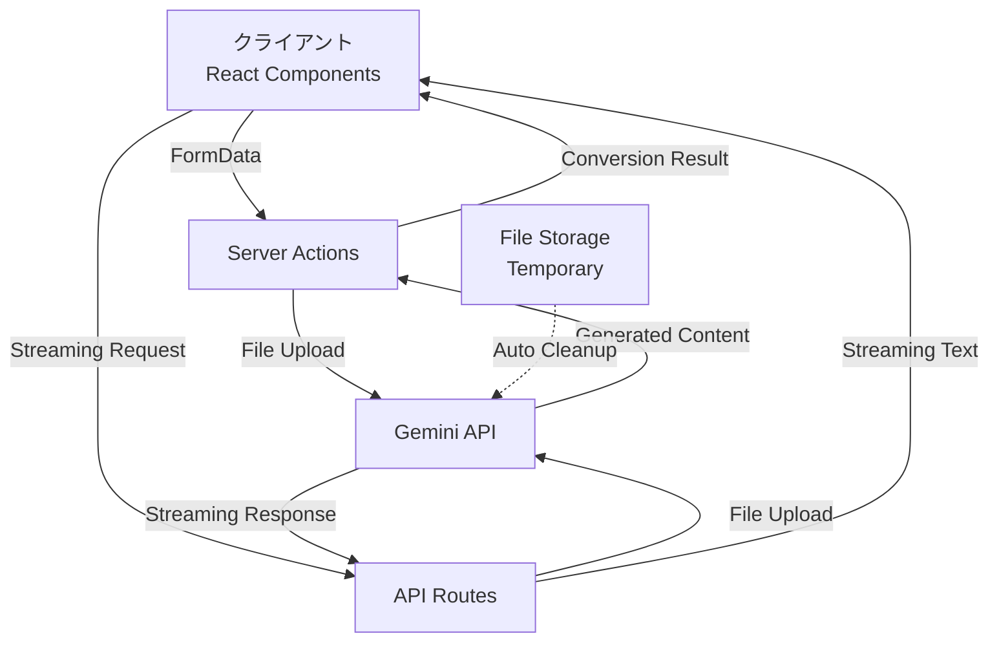

# 技術仕様書 - math-md

## 1. プロジェクト概要

### 1.1 システム概要
math-mdは、数学コンテンツを含むPDFファイルを高品質なMarkdownファイルに変換するWebアプリケーションです。Google Gemini APIを活用し、数式・表・画像を正確に抽出・変換します。

### 1.2 主要機能
- PDFファイルのドラッグ&ドロップアップロード
- リアルタイム処理進捗表示
- ストリーミング対応による高速レスポンス
- 数式のLaTeX形式保持（ブロック形式: $$...$$）
- Markdownファイルのダウンロード

### 1.3 技術スタック
- **フロントエンド**: Next.js 15 (App Router) + TypeScript
- **スタイリング**: Tailwind CSS + shadcn/ui
- **バックエンド**: Next.js Server Actions + Edge Runtime
- **AI/ML**: Google Gemini API (gemini-2.0-flash)
- **開発環境**: Turbopack

## 2. アーキテクチャ設計

### 2.1 システムアーキテクチャ



### 2.2 データフロー

1. **アップロード段階**
   - ユーザーがPDFをドラッグ&ドロップ
   - FormDataとしてServer Actionに送信
   - ファイルバリデーション実行

2. **処理段階**
   - Gemini APIへファイルアップロード
   - プロンプトと共に変換リクエスト送信
   - ストリーミングレスポンス受信

3. **出力段階**
   - Markdown形式に整形
   - クライアントへ結果送信
   - ダウンロード可能な形式で提供

## 3. 詳細実装仕様

### 3.1 ディレクトリ構造

```
math-md/
├── app/                          # Next.js App Router
│   ├── layout.tsx               # ルートレイアウト
│   ├── page.tsx                 # ホームページ
│   ├── actions/                 # Server Actions
│   │   └── convert.ts           # PDF変換アクション
│   └── api/                     # API Routes
│       └── convert/
│           └── stream/
│               └── route.ts     # ストリーミングエンドポイント
├── components/                  # UIコンポーネント
│   ├── ui/                      # shadcn/uiコンポーネント
│   └── features/                # 機能別コンポーネント
│       ├── FileUploader.tsx     # ファイルアップロード
│       ├── ConversionProgress.tsx # 進捗表示
│       └── MarkdownPreview.tsx  # プレビュー
├── lib/                         # ユーティリティ
│   ├── gemini/                  # Gemini API関連
│   │   ├── client.ts           # APIクライアント
│   │   ├── prompts.ts          # プロンプト定義
│   │   └── converter.ts        # 変換ロジック
│   ├── validations/            # バリデーション
│   │   └── file.ts            # ファイル検証
│   └── utils/                  # 汎用ユーティリティ
├── types/                      # TypeScript型定義
└── hooks/                      # カスタムフック
```

### 3.2 コンポーネント仕様

#### 3.2.1 FileUploader Component

```typescript
interface FileUploaderProps {
  onUploadComplete?: (result: ConversionResult) => void;
  onError?: (error: Error) => void;
}

interface FileUploaderState {
  file: File | null;
  status: 'idle' | 'uploading' | 'processing' | 'completed' | 'error';
  progress: number;
  result: ConversionResult | null;
  error: string | null;
}
```

主要機能:
- react-dropzoneによるドラッグ&ドロップ
- ファイルサイズ・形式のバリデーション
- アップロード進捗のリアルタイム表示
- エラーハンドリングとリトライ機能

#### 3.2.2 Server Actions仕様

```typescript
// app/actions/convert.ts
interface ConvertActionInput {
  file: File;
  options?: {
    mathFormat?: 'block' | 'inline';
    includeImages?: boolean;
    preserveFormatting?: boolean;
  };
}

interface ConvertActionOutput {
  success: boolean;
  markdown?: string;
  metadata?: {
    fileName: string;
    pageCount: number;
    processingTime: number;
    extractedAt: Date;
  };
  error?: {
    code: ErrorCode;
    message: string;
  };
}
```

### 3.3 Gemini API統合

#### 3.3.1 クライアント初期化

```typescript
// lib/gemini/client.ts
import { GoogleGenAI } from '@google/generative-ai';

export class GeminiClient {
  private ai: GoogleGenAI;
  private model: string = 'gemini-2.0-flash';

  constructor(apiKey: string) {
    this.ai = new GoogleGenAI({ apiKey });
  }

  async uploadFile(file: File): Promise<UploadedFile> {
    return await this.ai.files.upload({
      file,
      config: {
        mimeType: 'application/pdf',
        displayName: file.name
      }
    });
  }

  async generateContent(file: UploadedFile, prompt: string) {
    return await this.ai.models.generateContentStream({
      model: this.model,
      contents: [{
        parts: [
          { text: prompt },
          { fileData: { 
            mimeType: file.mimeType, 
            fileUri: file.uri 
          }}
        ]
      }],
      config: {
        maxOutputTokens: 8192,
        temperature: 0.1, // 低温度で一貫性を確保
      }
    });
  }
}
```

#### 3.3.2 プロンプトエンジニアリング

```typescript
// lib/gemini/prompts.ts
export const PDF_TO_MARKDOWN_PROMPT = `
あなたはPDFからMarkdownへの変換専門家です。
以下の規則に厳密に従って、提供されたPDFを高品質なMarkdown形式に変換してください。

## 変換規則

### 1. 数式の処理
- すべての数式はブロック形式（$$...$$）で出力
- LaTeX記法を完全に保持
- 数式内の改行やスペースも維持
- インライン数式も$$で囲んでブロック化

例:
$$
E = mc^2
$$

### 2. 表の処理
- Markdownテーブル形式を使用
- ヘッダー行を正確に識別
- セルの配置（左寄せ、中央、右寄せ）を保持
- 空のセルも適切に処理

例:
| 列1 | 列2 | 列3 |
|-----|:---:|----:|
| 左寄せ | 中央 | 右寄せ |

### 3. 画像の処理
- 形式で出力
- 図番号やキャプションがあれば代替テキストに含める
- 画像の前後に適切な改行を挿入

### 4. 見出しの処理
- PDFの文書構造を分析し、適切な見出しレベルを判断
- # (h1) から ###### (h6) まで使用
- 番号付き見出しの場合、番号も保持

### 5. リストの処理
- 番号付きリスト: 1. 2. 3. 形式
- 番号なしリスト: - または * 形式
- ネストレベルをスペースで正確に表現
- リスト項目内の改行も保持

### 6. その他の要素
- コードブロック: \`\`\`言語名 で囲む
- 引用: > を使用
- 強調: **太字**、*斜体*
- リンク: [テキスト](URL)

## 出力形式
- UTF-8エンコーディング
- 適切な改行とスペーシング
- セクション間に空行を挿入
- Markdownのベストプラクティスに従う

変換を開始してください。
`;
```

### 3.4 エラーハンドリング

#### 3.4.1 エラー種別定義

```typescript
// types/errors.ts
export enum ErrorCode {
  // ファイル関連
  FILE_TOO_LARGE = 'FILE_TOO_LARGE',
  INVALID_FILE_FORMAT = 'INVALID_FILE_FORMAT',
  FILE_UPLOAD_FAILED = 'FILE_UPLOAD_FAILED',
  
  // API関連
  GEMINI_API_ERROR = 'GEMINI_API_ERROR',
  RATE_LIMIT_EXCEEDED = 'RATE_LIMIT_EXCEEDED',
  PROCESSING_TIMEOUT = 'PROCESSING_TIMEOUT',
  
  // システム関連
  INTERNAL_ERROR = 'INTERNAL_ERROR',
  NETWORK_ERROR = 'NETWORK_ERROR',
}

export const ERROR_MESSAGES: Record<ErrorCode, string> = {
  [ErrorCode.FILE_TOO_LARGE]: 'ファイルサイズが大きすぎます（最大10MB）',
  [ErrorCode.INVALID_FILE_FORMAT]: 'PDFファイルのみアップロード可能です',
  [ErrorCode.FILE_UPLOAD_FAILED]: 'ファイルのアップロードに失敗しました',
  [ErrorCode.GEMINI_API_ERROR]: '変換処理中にエラーが発生しました',
  [ErrorCode.RATE_LIMIT_EXCEEDED]: 'API制限に達しました。しばらく待ってから再試行してください',
  [ErrorCode.PROCESSING_TIMEOUT]: '処理がタイムアウトしました',
  [ErrorCode.INTERNAL_ERROR]: 'システムエラーが発生しました',
  [ErrorCode.NETWORK_ERROR]: 'ネットワークエラーが発生しました',
};
```

#### 3.4.2 エラーハンドリング実装

```typescript
// lib/error-handler.ts
export class AppError extends Error {
  constructor(
    public code: ErrorCode,
    public message: string = ERROR_MESSAGES[code],
    public details?: any
  ) {
    super(message);
    this.name = 'AppError';
  }
}

export function handleError(error: unknown): AppError {
  if (error instanceof AppError) {
    return error;
  }
  
  if (error instanceof Error) {
    // Gemini API固有のエラー
    if (error.message.includes('429')) {
      return new AppError(ErrorCode.RATE_LIMIT_EXCEEDED);
    }
    if (error.message.includes('timeout')) {
      return new AppError(ErrorCode.PROCESSING_TIMEOUT);
    }
  }
  
  return new AppError(ErrorCode.INTERNAL_ERROR);
}
```

### 3.5 パフォーマンス最適化

#### 3.5.1 ストリーミング実装

```typescript
// app/api/convert/stream/route.ts
export const runtime = 'edge'; // Edge Runtimeで高速化

export async function POST(req: Request) {
  const encoder = new TextEncoder();
  const decoder = new TextDecoder();
  
  const stream = new TransformStream();
  const writer = stream.writable.getWriter();
  
  // バックグラウンドで処理
  (async () => {
    try {
      const formData = await req.formData();
      const file = formData.get('file') as File;
      
      // Gemini APIストリーミング
      const response = await geminiClient.generateContentStream(file);
      
      for await (const chunk of response) {
        const text = chunk.text;
        await writer.write(encoder.encode(text));
      }
    } catch (error) {
      await writer.write(
        encoder.encode(`data: ${JSON.stringify({ error: true })}\n\n`)
      );
    } finally {
      await writer.close();
    }
  })();
  
  return new Response(stream.readable, {
    headers: {
      'Content-Type': 'text/event-stream',
      'Cache-Control': 'no-cache',
      'Connection': 'keep-alive',
    },
  });
}
```

#### 3.5.2 キャッシング戦略

```typescript
// lib/cache.ts
interface CacheEntry {
  markdown: string;
  metadata: ConversionMetadata;
  createdAt: Date;
}

export class ConversionCache {
  private cache = new Map<string, CacheEntry>();
  private maxAge = 3600000; // 1時間
  
  async get(fileHash: string): Promise<CacheEntry | null> {
    const entry = this.cache.get(fileHash);
    if (!entry) return null;
    
    const age = Date.now() - entry.createdAt.getTime();
    if (age > this.maxAge) {
      this.cache.delete(fileHash);
      return null;
    }
    
    return entry;
  }
  
  async set(fileHash: string, data: Omit<CacheEntry, 'createdAt'>) {
    this.cache.set(fileHash, {
      ...data,
      createdAt: new Date()
    });
  }
}
```

## 4. セキュリティ仕様

### 4.1 入力検証

```typescript
// lib/validations/file.ts
import { z } from 'zod';

export const FileUploadSchema = z.object({
  file: z
    .instanceof(File)
    .refine((file) => file.size <= 10 * 1024 * 1024, {
      message: 'ファイルサイズは10MB以下にしてください',
    })
    .refine((file) => file.type === 'application/pdf', {
      message: 'PDFファイルのみアップロード可能です',
    }),
  options: z.object({
    mathFormat: z.enum(['block', 'inline']).default('block'),
    includeImages: z.boolean().default(true),
    preserveFormatting: z.boolean().default(true),
  }).optional(),
});
```

### 4.2 レート制限

```typescript
// lib/rate-limiter.ts
interface RateLimitConfig {
  windowMs: number;  // 時間窓（ミリ秒）
  maxRequests: number; // 最大リクエスト数
}

export class RateLimiter {
  private requests = new Map<string, number[]>();
  
  constructor(private config: RateLimitConfig) {}
  
  async checkLimit(identifier: string): Promise<boolean> {
    const now = Date.now();
    const userRequests = this.requests.get(identifier) || [];
    
    // 古いリクエストを削除
    const validRequests = userRequests.filter(
      (timestamp) => now - timestamp < this.config.windowMs
    );
    
    if (validRequests.length >= this.config.maxRequests) {
      return false; // レート制限に達した
    }
    
    validRequests.push(now);
    this.requests.set(identifier, validRequests);
    return true;
  }
}
```

### 4.3 環境変数管理

```bash
# .env.local
GEMINI_API_KEY=your_gemini_api_key_here
NEXT_PUBLIC_APP_URL=http://localhost:3000
NODE_ENV=development

# .env.production
GEMINI_API_KEY=your_production_api_key
NEXT_PUBLIC_APP_URL=https://math-md.vercel.app
NODE_ENV=production
```

## 5. テスト仕様

### 5.1 単体テスト

```typescript
// __tests__/lib/gemini/converter.test.ts
import { describe, it, expect, vi } from 'vitest';
import { GeminiConverter } from '@/lib/gemini/converter';

describe('GeminiConverter', () => {
  it('should convert PDF to Markdown', async () => {
    const mockFile = new File(['content'], 'test.pdf', {
      type: 'application/pdf'
    });
    
    const converter = new GeminiConverter();
    const result = await converter.convert(mockFile);
    
    expect(result).toMatchObject({
      markdown: expect.any(String),
      metadata: {
        fileName: 'test.pdf',
        pageCount: expect.any(Number),
      }
    });
  });
});
```

### 5.2 E2Eテスト

```typescript
// e2e/conversion-flow.spec.ts
import { test, expect } from '@playwright/test';

test('PDF to Markdown conversion flow', async ({ page }) => {
  await page.goto('/');
  
  // ファイルアップロード
  const fileInput = page.locator('input[type="file"]');
  await fileInput.setInputFiles('fixtures/sample.pdf');
  
  // 進捗表示の確認
  await expect(page.locator('[data-testid="progress-bar"]')).toBeVisible();
  
  // 結果の確認
  await expect(page.locator('[data-testid="markdown-preview"]')).toBeVisible();
  
  // ダウンロードボタンの確認
  const downloadButton = page.locator('[data-testid="download-button"]');
  await expect(downloadButton).toBeEnabled();
});
```

## 6. デプロイメント仕様

### 6.1 ビルド設定

```json
// package.json
{
  "scripts": {
    "dev": "next dev --turbopack",
    "build": "next build",
    "start": "next start",
    "lint": "next lint",
    "type-check": "tsc --noEmit",
    "test": "vitest",
    "test:e2e": "playwright test"
  }
}
```

### 6.2 Vercelデプロイ設定

```json
// vercel.json
{
  "buildCommand": "npm run build",
  "outputDirectory": ".next",
  "devCommand": "npm run dev",
  "installCommand": "npm install",
  "framework": "nextjs",
  "regions": ["hnd1"], // 東京リージョン
  "functions": {
    "app/api/convert/stream/route.ts": {
      "maxDuration": 60 // 最大60秒
    }
  }
}
```

## 7. 監視・運用仕様

### 7.1 ログ設定

```typescript
// lib/logger.ts
export const logger = {
  info: (message: string, data?: any) => {
    console.log(JSON.stringify({ 
      level: 'info', 
      message, 
      data, 
      timestamp: new Date().toISOString() 
    }));
  },
  error: (message: string, error?: any) => {
    console.error(JSON.stringify({ 
      level: 'error', 
      message, 
      error: error?.message || error,
      stack: error?.stack,
      timestamp: new Date().toISOString() 
    }));
  }
};
```

### 7.2 メトリクス

監視対象:
- API応答時間
- 変換成功率
- エラー発生率
- Gemini API使用量
- ファイルサイズ分布

## 8. 今後の拡張計画

### Phase 1 (MVP) - 実装済み
- 基本的なPDF→Markdown変換
- ドラッグ&ドロップUI
- ダウンロード機能

### Phase 2 - 計画中
- バッチ処理（複数ファイル同時変換）
- 変換履歴機能
- カスタムプロンプト設定
- OCR機能の追加

### Phase 3 - 将来構想
- APIとして公開
- プラグイン/拡張機能対応
- 他のAIモデル対応
- エンタープライズ機能